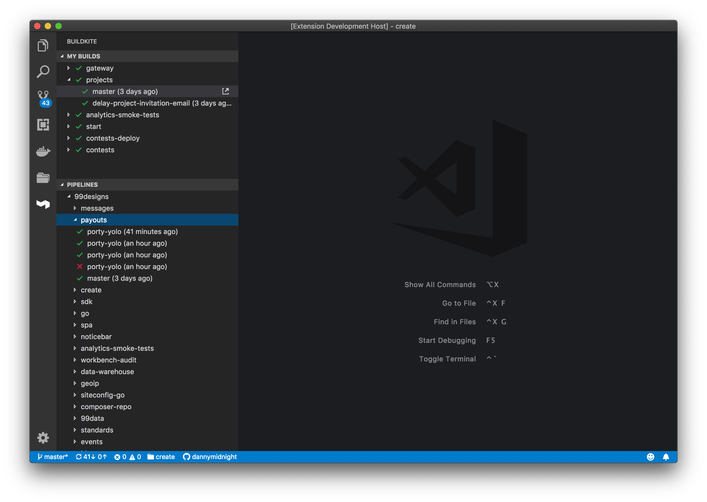

# Buildkite Support for Visual Studio Code

This extension adds support to monitor [Buildkite](https://buidkite.com) builds from within your editor.

## Features

* Keep track of your recent builds
* Monitor builds across organizations/pipelines
* Jump directly to builds and pipelines

## Requirements

This extension requires a [Buildkite API Access Token](https://buildkite.com/user/api-access-tokens/new) with GraphQL API access enabled.

## Extension Settings

This extension contributes the following settings:

* `buildkite.pollBuildkiteEnabled`: Poll Buildkite for updates
* `buildkite.pollBuildkiteInterval`: Poll interval (seconds)

## Contributing

Feel free to open issues and pull requests following this [contribution guide](./docs/contributing.md).
